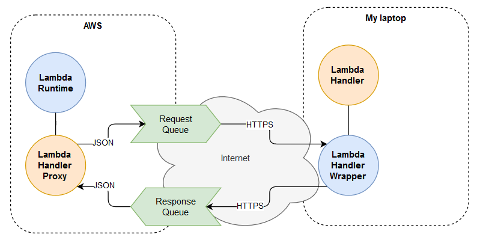
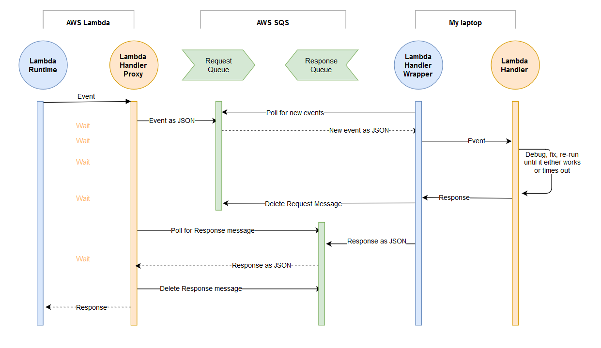

# Lambda Proxy Function for Remote Debugging

*I often need to debug complex Lambda setups that are tightly integrated into other services and are hard to simulate in my dev environment. Even if I manage to grab the event JSON it is hard to send the response back in a timely manner. What I always wanted was to invoke Lambda handlers locally in response to AWS events in real time. This project is an early attempt to solve this problem.*

This lambda function sends both `Payload` and `Context` to a predefined SQS queue and then waits for a response that is deserialized and passed back onto the runtime.

In the meantime, you can read the message from the queue, deserialize  `Payload` and `Context`, process it locally and send back a response. If your local lambda fails you can re-read the message until either the proxy lambda times out or you send back a reply.



The benefit of this approach *vs* using a local [mock environment](https://aws.amazon.com/premiumsupport/knowledge-center/lambda-layer-simulated-docker/) is the full integration in your infra. It is not always possible to use mock input or try to copy the input by hand. The proxy function will give you near-real time request/response with real data.

### Components

- **Lambda Runtime** - a [modified Lambda runtime for Rust](https://github.com/rimutaka/aws-lambda-rust-runtime/tree/proxy-experiment) that adds a few required features
- **Lambda Handler Proxy** - a [handler](https://github.com/rimutaka/lambda-debug-proxy/blob/master/src/main.rs) that relays data to/from SQS queues
- **Request Queue** - an SQS queue for forwarding event details to the dev environment
- **Response Queue** - an SQS queue for forwarding response details from the dev environment
- **Lambda Handler Wrapper** - a [Lambda handler wrapper](https://github.com/rimutaka/lambda-debug-proxy/blob/master/examples/local.rs) running in dev environment and communicating with SQS queues
- **Lambda Handler** - the handler function that is supposed to run on AWS Lambda, but will be debugged in the local dev environment

If you are not familiar with [AWS SQS](https://docs.aws.amazon.com/AWSSimpleQueueService/latest/SQSDeveloperGuide/welcome.html) you may not know that the messages [have to be explicitly deleted](https://docs.aws.amazon.com/AWSSimpleQueueService/latest/APIReference/API_DeleteMessage.html) from the queue. The request messages are deleted by the handler wrapper when the handler returns a response. This allows re-running the handler if it fails before sending a response, which is a handy debugging feature. The response messages are deleted by the handler proxy as soon as they arrive.

It is possible for the response to arrive too late because either the Lambda Runtime or the caller timed out. For example, AWS APIGateway wait is limited to 30s. The Lambda function can be configured to wait for up to 15 minutes. Remember to check that all stale messages got deleted and purge the queues via the console or AWS CLI if needed. 



### Deployment

Replace `--region ap-southeast-2` and `--function-name lambda-debug-proxy` with your values.

```
cargo build --release --target x86_64-unknown-linux-musl

cp ./target/x86_64-unknown-linux-musl/release/lambda-debug-proxy ./bootstrap && zip proxy.zip bootstrap && rm bootstrap

aws lambda update-function-code --region ap-southeast-2 --function-name lambda-debug-proxy --zip-file fileb://proxy.zip
```

### Lambda config

Create an empty Lambda function with `Custom runtime on Amazon Linux 2` and run the deployment script from the previous section. It will build and upload the code to AWS.

Recommended settings:

- **Runtime**: Custom runtime on Amazon Linux 2
- **Memory (MB)**: 128
- **Timeout**: 15min 0sec
- **Reserved concurrency**: 1
- **Maximum age of event**: 0h 1min 0sec
- **Retry attempts**: 0


#### Env variables
- `LAMBDA_PROXY_TRACING_LEVEL` - optional, default=INFO, use DEBUG to get full lambda logging or TRACE to go deeper into dependencies.
- `AWS_DEFAULT_REGION` or `AWS_REGION` - required, but they should be pre-set by AWS
- `LAMBDA_PROXY_REQ_QUEUE_URL` - the Queue URL for Lambda requests, required
- `LAMBDA_PROXY_RESP_QUEUE_URL` - the Queue URL for Lambda responses, required

### Queue config

Create `LAMBDA_PROXY_REQ` and `LAMBDA_PROXY_RESP` SQS queues. Allow r/w access to both from the Lambda and Client IAM Roles.

Recommended settings:

- **Type**: Standard
- **Maximum message size**: 256 KB
- **Default visibility timeout**: 10 Seconds
- **Message retention period**: 1 Hour
- **Receive message wait time**: 20 Seconds

### Client config

The lambda code running on your local machine has to be wrapped into a client that reads the queue, de-serializes the payload into your required format, calls your lambda and sends the response back. It is the exact reverse of what the  proxy function does. See [local.rs example](examples/local.rs) for a sample Rust implementation. It should be easy to port the sample wrapper into the language of your Lambda handler. There is no need to refactor the proxy.

#### Running the Rust client from `examples/local.rs`:

1. Create a Lambda proxy with two queues on AWS.
2. Configure env vars
3. Prepare a test even for the proxy lambda
4. Copy-paste the queue URLs and Region into your local client (`examples/local.rs`)
5. Start the local client with `cargo run --example local`
6. Fire the test event in the proxy lambda

Your local client will read the message from `LAMBDA_PROXY_REQ` queue, send a response to `LAMBDA_PROXY_RESP` queue and exit. The proxy lambda will wait for a response and finish its execution as soon as it arrives or time out.
