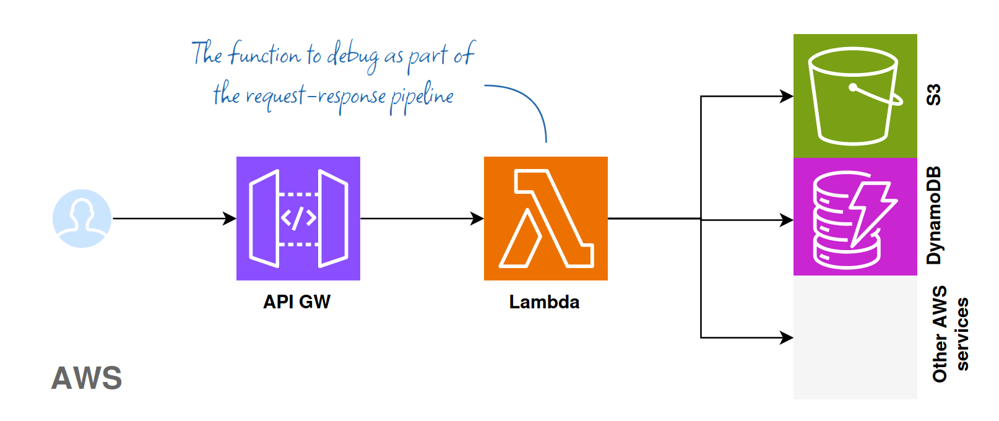
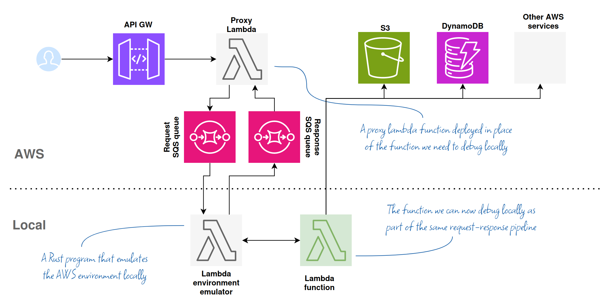

# Lambda Runtime Emulator for local debugging

This runtime emulator allows debugging AWS Lambda functions written in Rust locally while receiving the payload from AWS and sending the responses back as if you were doing remote debugging inside the AWS environment.


## How it works

This project has two crates:

__Production configuration__

Consider this typical Lambda use case:



__Debugging configuration__

- _proxy-lambda_ crate forwards Lambda requests and responses between AWS and your development machine in real time
- _runtime-emulator_ crate provides necessary APIs and exchanges payloads with _proxy-lambda_ to enable your Lambda function to run locally



## Getting started

__Initial setup:__

- clone and build this repository locally
- create _request_ and _response_ queues in SQS with IAM permissions

__Per Lambda function:__

- deploy _proxy-lambda_ in place of the function you need to debug
- run the emulator in the terminal on the local machine as a binary or with `cargo run`
- run your lambda locally with `cargo run`


Detailed instructions and code samples for the above steps are provided further in this document.

### Limitations

This emulator provides the necessary API endpoints for the lambda function to run. It does not:

* constrain the environment, e.g. memory or execution time
* report errors back to AWS
* handle concurrent requests
* copies the entire set of env vars from AWS (see [runtime-emulator/env-template.sh](runtime-emulator/env-template.sh))
* support X-Trace or Extensions APIs


## Deployment in detail

### SQS configuration

- Create `proxy_lambda_req` SQS queue for requests to be sent from AWS to your local lambda under debugging. _Required_.
- Create `proxy_lambda_resp` SQS queue if you want responses from your local lambda to be returned to the caller. _Optional_.

See _Advanced setup_ section for more info on how to customize queue names and other settings.

Recommended queue settings:

- **Queue type**: Standard
- **Maximum message size**: 256 KB
- **Default visibility timeout**: 10 Seconds
- **Message retention period**: 1 Hour
- **Receive message wait time**: 20 Seconds

This IAM policy grants _proxy-lambda_ access to the queues.
It assumes that you already have sufficient privileges to access Lambda and SQS from your local machine.

Replace _Principal_ and _Resource_ IDs with your values before adding this policy to the queue config.

```json
{
  "Version": "2012-10-17",
  "Statement": [
    {
      "Effect": "Allow",
      "Principal": {
        "AWS": "arn:aws:iam::512295225992:role/lambda_basic"
      },
      "Action": [
        "sqs:DeleteMessage",
        "sqs:GetQueueAttributes",
        "sqs:ReceiveMessage",
        "sqs:SendMessage"
      ],
      "Resource": "arn:aws:sqs:us-east-1:512295225992:proxy_lambda_req"
    }
  ]
}
```
- _Principal_ - is the IAM role your lambda assumes (check Lambda's Permissions Config tab in the AWS console to find the value)
- _Resource_ - the ARN of the queue the policy is attached to (see the queue details page in the AWS console to find the value)


### Building and deploying _proxy-lambda_

The _proxy lambda_ function should be deployed to AWS Lambda in place of the function you want to debug.

Replace the following parts of the snippet with your values before running it from the project root:
- _target_ - the architecture of the lambda function on AWS, e.g. `x86_64-unknown-linux-gnu`
- _region_ - the region of the lambda function, e.g. `us-east-1`
- _name_ - the name of the lambda function you want to replace with the proxy, e.g. `my-lambda`

```
target=x86_64-unknown-linux-gnu 
region=us-east-1
name=my-lambda

cargo build --release --target $target
cp ./target/$target/release/proxy-lambda ./bootstrap && zip proxy.zip bootstrap && rm bootstrap
aws lambda update-function-code --region $region --function-name $name --zip-file fileb://proxy.zip
```

A deployed _proxy-lambda_ should return _OK_ or time out if you run it with the test event from the console.


### Lambda environmental variables

These env vars are optional and can be omitted if you use the default queue names (`proxy_lambda_req`, `proxy_lambda_resp`) in the same region as the lambda.

- `RUST_LOG` - logging level, defaults to `INFO`, set it to `proxy=debug` to see more detailed info
- `PROXY_LAMBDA_REQ_QUEUE_URL` - the Queue URL for Lambda proxy _requests_ if the queue name is different from the default
- `PROXY_LAMBDA_RESP_QUEUE_URL` - the Queue URL for Lambda handler _responses_ if the queue name is different from the default

## Debugging

__Pre-requisites:__
- _proxy-lambda_ was deployed to AWS
- SQS queues were created with the appropriate access policies

__Launching the emulator:__
- start the _runtime-emulator_ in the terminal as a binary or with `cargo run`
- the app should inform you it is listening on a certain port

__Launching the local lambda:__
- run [runtime-emulator/env-lambda.sh](runtime-emulator/env-minlambdaimal.sh) in a terminal window on your local machine
- start your lambda in the same terminal window with `cargo run`
- the emulator will inform you it is waiting for an incoming message from the SQS

__Debugging:__
- trigger the event on AWS as part of your normal data flow, e.g. by a user action on a webpage
- the emulator should display the lambda payload and forward it to your local lambda for processing
- debug as needed
- successful responses are sent back to the caller if the response queue is configured 

The same SQS message is reused until the lambda completes successfully.


If the local lambda fails, terminates or panics, you can make changes to the code and run it again to reuse the same payload.


## Advanced setup

### SQS

If you are not familiar with [AWS SQS](https://docs.aws.amazon.com/AWSSimpleQueueService/latest/SQSDeveloperGuide/welcome.html) you may not know that the messages [have to be explicitly deleted](https://docs.aws.amazon.com/AWSSimpleQueueService/latest/APIReference/API_DeleteMessage.html) from the queue. The request messages are deleted by the handler wrapper when the handler returns a response. This allows re-running the handler if it fails before sending a response, which is a handy debugging feature. The response messages are deleted by the handler proxy as soon as they arrive.

It is possible for the response to arrive too late because either the Lambda Runtime or the caller timed out. For example, AWS APIGateway wait is limited to 30s. The Lambda function can be configured to wait for up to 15 minutes. Remember to check that all stale messages got deleted and purge the queues via the console or AWS CLI if needed. 


The proxy runs asynchronously if no `PROXY_LAMBDA_RESP_QUEUE_URL` is specified. It sends the request to the request queue and returns `OK` regardless of what happens at the remote handler's end.
This is useful for debugging asynchronous functions like S3 event handlers.

### Large payloads and data compression

The proxy Lambda function running on AWS and the client running on the dev's machine send JSON payload to SQS. The size of the payload is [limited to 262,144 bytes by SQS](https://docs.aws.amazon.com/AWSSimpleQueueService/latest/SQSDeveloperGuide/quotas-messages.html). To get around this limitation the client may compress the JSON payload using [flate2 crate](https://crates.io/crates/flate2) and send it as an encoded Base58 string. The encoding/decoding happens automatically at both ends. Only large messages are compressed because it takes up to a few seconds in debug mode.

### Logging

Both _proxy-lambda_ and _runtime-emulator_ use `RUST_LOG` env var to set the logging level and filters.
If `RUST_LOG` is not present or is empty, both crates log at the _INFO_ level and suppress logging from their dependencies.
See [https://docs.rs/tracing-subscriber/latest/tracing_subscriber/filter/struct.EnvFilter.html#example-syntax] for more info.

Examples of `RUST_LOG` values:
- `error` - log errors only
- `warn,runtime_emulator=info` - _INFO_ level for the _runtime-emulator_, _WARN_ level for everything else